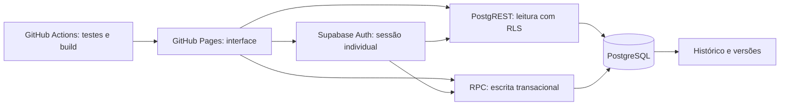

# Análise de arquitetura — BOGGE

## Decisão

GitHub Pages hospeda apenas HTML, CSS e JavaScript. Supabase Auth gerencia as credenciais; PostgreSQL mantém o estado de produção, aprovações de acesso e histórico. O navegador pode ser modificado pelo usuário, portanto nenhuma regra de negócio depende exclusivamente dos botões exibidos. Google Drive não participa desta versão, conforme decisão do responsável.

## Avaliação da proposta

| Tema | Risco da implementação simples | Solução aplicada |
|---|---|---|
| Permissões por etapa | Esconder botões não impede chamadas diretas | Escrita somente por funções SQL, papel obtido do banco e sessão validada |
| PCP | Perfil enviado no cadastro pode virar administrador | Cadastro pendente; promoção somente por PCP ou bootstrap administrativo |
| Numeração | Dois usuários geram o mesmo número | Sequence PostgreSQL, unicidade e geração no servidor |
| Avanço de cards | Salvar dados e mover em requisições separadas produz inconsistência | Dados, histórico, versão e avanço na mesma transação |
| Edição simultânea | Última gravação apaga trabalho alheio | Bloqueio de linha e versão otimista, com mensagem para reabrir o card |
| Histórico | Substituir grade perde a origem da mudança | Snapshots de entrada e saída por etapa + eventos com antes/depois |
| Refugos | Comparar sempre com Corte desconta as mesmas peças diversas vezes | Conservação por tamanho contra entrada real; Corte exibido como referência |
| Consertos | Subtrair consertos como perdas reduz o saldo incorretamente | Quantidade de consertos menor ou igual à saída, descrição obrigatória |
| Datas | Relógio local e UTC podem aceitar/rejeitar o dia errado | Regras no servidor usando São Paulo, com exceção para valor já salvo |
| Rascunhos | Exigir data de retorno no envio impede operação durante dias | Rascunho parcial sem avanço; campos completos exigidos na finalização |
| OP | Duplicatas comprometem rastreamento | Índice único para OP finalizada |
| Publicação | Chaves administrativas embutidas expõem o banco | Apenas chave pública no bundle; RLS e grants mínimos |
| Armazenamento | Planilhas/Drive como banco dificultam concorrência e auditoria | Supabase como fonte única; anexos futuros separados |

## Modelo de dados

`profiles`: ID da conta Auth, nome, perfil, situação e criação. Nenhum usuário pode se autoaprovar. A desativação bloqueia operações no banco sem depender da expiração do token.

`plans`: identidade e número do planejamento, autor e data, referência/descrição/responsável/combinação, observação, grade planejada e corrente, etapa e versão. Dados de OP e costura externa resumidos para consultas do painel.

`stage_records`: uma linha por planejamento/etapa, campos específicos em JSON, grade de entrada, grade de saída, refugos, consertos, operador e datas de salvamento/finalização. Linhas finalizadas não são reabertas pela API.

`audit_events`: eventos somente de acréscimo para o cliente, com snapshots anteriores e novos. Permissões também são auditadas. Administradores do banco continuam tecnicamente capazes de modificar o histórico; isto não é uma trilha inviolável contra o proprietário do banco.

Campos variáveis ficam em JSONB para simplificar os formulários de oito etapas. Identidade, estado, versão, vínculos e campos pesquisáveis centrais permanecem relacionais. A função SQL valida as grades e os campos exigidos antes de finalizar. Todas as funções privilegiadas usam `search_path` vazio e nomes qualificados; execução pública e de anônimos é revogada.

## Regras e decisões de produto

1. Incluído perfil **Planejamento** e perfil **Costura**, além dos solicitados, porque ambos têm operações próprias no fluxo. PCP cobre todas as etapas.
2. O planejamento editável fica limitado ao período anterior ao primeiro rascunho de Risco. Depois disso, corrigir quantidades significa registrar a diferença na etapa atual, preservando o histórico.
3. A permissão total do PCP foi interpretada como exceção à edição exclusiva pelo criador, ainda limitada à fase anterior ao Risco. Esta regra está explícita no README e nas funções.
4. A repetição de “Acabamento” no trecho de Embalagem foi interpretada como início/fim, conferência, refugos e consertos da própria Embalagem. Após ela, o destino é **Concluído**.
5. Usuários aprovados visualizam todos os cards, mas escrevem apenas em sua etapa. Usuários pendentes veem somente seu cadastro.
6. Datas novas iguais ou posteriores ao dia atual são aceitas, conforme solicitado. Não se impõe que datas de execução sejam menores ou iguais ao dia atual. Fim anterior ao início e retorno anterior ao envio são rejeitados.
7. Refugo físico começa em Costura; alterações de aproveitamento em Risco/Corte/PCP são registradas como diferenças de grade.
8. Consertos são ocorrências registradas por etapa. Esta versão não gerencia uma fila paralela de retrabalho com resolução, encaminhamento ou identificação individual por peça.

## Interface e desempenho

Aplicação em módulos JavaScript, Vite e SDK oficial Supabase, sem framework de interface. Ícones selecionados têm tree shaking; painel com rolagem horizontal preserva a ordem real das etapas. Componentes HTML nativos incluem formulários, `dialog`, tabelas e `details`, com controles nomeados e navegação por teclado. Textos fornecidos por usuários são escapados antes de inserção no HTML.

O painel busca dados paginados em lotes de 500 para não truncar silenciosamente no limite da API. Atualiza a cada 30 segundos somente quando visível e sem formulário aberto. Salvamentos atualizam imediatamente. Isso reduz complexidade em relação ao Realtime e evita sobrescrever um formulário em edição. As quantidades do resumo correspondem aos dados carregados no último refresh.

Para volumes muito maiores, substituir a carga completa por consultas de resumo, paginação por coluna, busca no servidor e carregamento sob demanda das etapas históricas. Os índices atuais atendem etapa/data, ordem de planejamento, vínculo das etapas e auditoria. Medir com dados reais antes de adicionar infraestrutura.

## Operação e publicação

Push em `main` executa testes e build; apenas esse ramo publica no Pages. Pull requests são validados sem publicar. Fonte Pages deve estar configurada como GitHub Actions. Repositório público contém código e chave pública, mas não contém dados reais.

Separar homologação e produção quando houver evolução frequente de regras. Adicionar migrações numeradas futuras; não reexecutar a migração inicial em banco populado. Usar os recursos de backup disponíveis no plano Supabase e testar restauração periodicamente. Não há promessa de PITR configurado nesta entrega.

Configuração necessária fora do código: migração, primeiro PCP, URLs de retorno do Auth, SMTP e configurações do Pages. A chave publicável não permite executar estas ações administrativas.

## Verificação e limites

Testes automatizados executam PostgreSQL embutido (PGlite) com RLS e papéis reais, mas simulação de `auth.uid()`. Verificam autorização negativa, validação das quantidades, transições completas, duplicidade, auditoria e conflito de edição. A homologação no Supabase real deve verificar emissão/renovação/revogação de sessão, políticas aplicadas, mensagens de confirmação e recuperação, e fluxo com dois usuários simultâneos.

Limites intencionais: sem integração Drive, sem estoque individual de peças, sem funcionamento offline, sem fila de consertos, sem mover cards para trás, sem exclusão de histórico e sem migração automática em produção pelo frontend.

## Referências oficiais

- [Supabase: Row Level Security](https://supabase.com/docs/guides/database/postgres/row-level-security)
- [Supabase: autenticação por senha](https://supabase.com/docs/guides/auth/passwords)
- [GitHub Pages: workflows de publicação](https://docs.github.com/en/pages/getting-started-with-github-pages/using-custom-workflows-with-github-pages)
